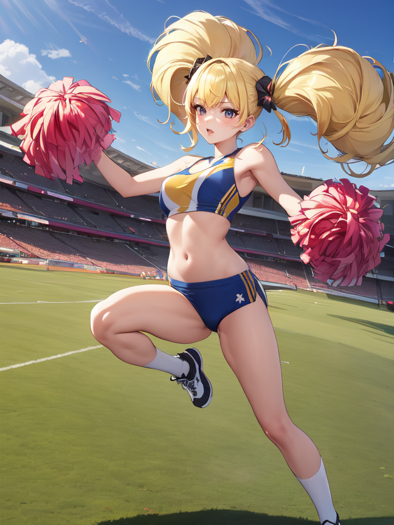
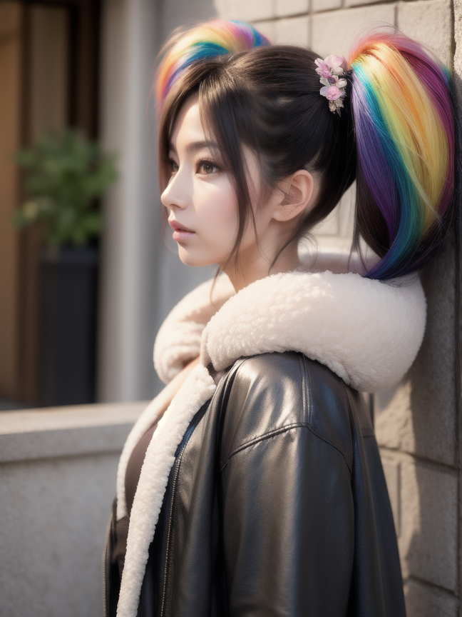

# LoRA - Mega Twintails

Open-sourced LoRA configuration and training data for Stable Diffusion 1.5.

| `f3e-1.0-pruned`                                     | `henmixReal_v40`                                     |
|----------------------------------------|-----------------------------------------------|
|  |  |

_Gonna be the twintail!!_

Becky, Poppy, Ashley... paragons of the style... Large, floofy twintails with maximum volume. No thintails here!

https://civitai.com/models/122312/mega-twintails

## Parameters

Recommended weight: `0.8`

Activation tags: `mega twintails`

Secondary tags: `big hair`, `short hair`, `long hair`, `absurdly long hair`

## Version History

#### 1.0

* Release

#### 1.1

* Reduced overfitting on red hair
* Reduced overfitting on large breasts

#### 2.0

* Open-sourced training data
* New base model - f3e
* Less overfitting on style and backgrounds
* Pruned unecessary UNet blocks
* Smaller file size - 3Mb down from 15Mb

## Training

* Load config into [Kohya SS](https://github.com/bmaltais/kohya_ss)
* Download a base model. I use a custom mix that I created called [f3e - Forge](TODO)
* Update paths for the model, image, output and logging folders
* Adjust the batch size for your GPU

| VRAM       | 24 GiB | 12 GiB | 8GiB |
|------------|--------|--------|------|
| Batch Size | 10     | 4      | 2-3  |
